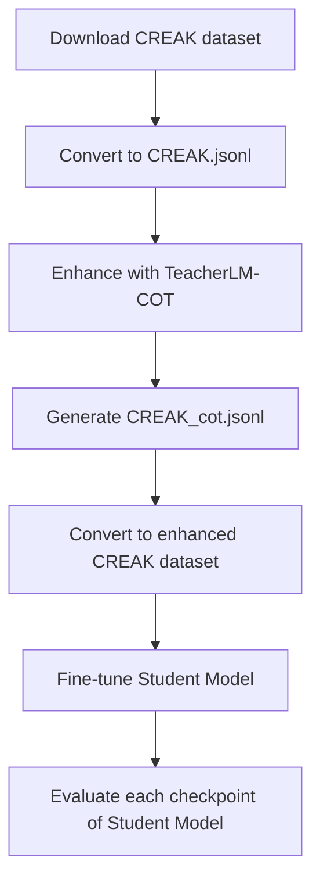

# Readme

Here is an entire pipeline of using our TeacherLM to enhance an unlabeled dataset, use the enhanced dataset to finetune student models, and finally evaluate finetuned models' performance of accuracy on test split.

This readme uses [`CREAK` Dataset](https://arxiv.org/abs/2109.01653) on the slurm system as an example.



Please download the dataset and save it to your disk through codes:

```python
ofrom datasets import load_dataset

dataset = load_dataset("amydeng2000/CREAK")

dataset.save_to_disk("./CREAK")
```

The `dataset` is:

```python
DatasetDict({
    train: Dataset({
        features: ['ex_id', 'sentence', 'explanation', 'label', 'entity', 'en_wiki_pageid', 'entity_mention_loc'],
        num_rows: 10176
    })
    validation: Dataset({
        features: ['ex_id', 'sentence', 'explanation', 'label', 'entity', 'en_wiki_pageid', 'entity_mention_loc'],
        num_rows: 1371
    })
})
```

Then we only use the training split to enhance and the test split to evaluate finetuned student model’s accuracy.

Before enhancement, we need to know the meaning of the `dataset`'s important fields. Pick `dataset["train"][1]` as an example.

```python
{'ex_id': 'train_1',
 'sentence': 'Marlboro used iconic imagery to promote its brand.',
 'explanation': 'Marlboro (cigarette) is used cowboys as an advertising campaign.',
 'label': 'true',
 'entity': 'Marlboro (cigarette)',
 'en_wiki_pageid': '404590',
 'entity_mention_loc': [[0, 8]]}
```

## Environment

### Installation

Our environment is friendly and easy to install. It is highly recommended to create a new virtual environment before you continue. You may create a virtual environment with `Python 3.10.0` and then follow these scripts to install:

```shell
conda install pytorch torchvision torchaudio pytorch-cuda=11.6 -c pytorch -c nvidia

python -m pip install transformers==4.23.1

python -m pip install datasets==2.6.1

python -m pip install accelerate

python -m pip install wandb

python -m pip install lm-eval

python -m pip install pytest

DS_BUILD_OPS=1 DS_BUILD_SPARSE_ATTN=0 python -m pip install deepspeed==0.8.0 --user

python -m pip install jsonlines
```

Note that you should install a corresponding `torch` based on your `CUDA` version. If you don’t use `conda` to install, `pip` is also preferred, which you can refer to at [PyTorch.org](https://pytorch.org/).

### Model

Refer to [Huggingface](https://huggingface.co/) to download the `OPT`, `BLOOM`, and `BLOOMZ` Models.

A typical download script is:

```python
from transformers import AutoTokenizer, AutoModelForCausalLM

tokenizer = AutoTokenizer.from_pretrained("{model name}", cache_dir="{cache dir}")

model = AutoModelForCausalLM.from_pretrained("{model name}", cache_dir="{cache dir}")
```

## Enhance

Before enhancing your dataset, please download our TeacherLM and prepare your dataset. We still use CREAK as an example.

### Dataset Prepare

You must add prompts to your dataset and convert its specific split into a `jsonl` file. Simply running this code is enough for `CREAK`.

```shell
python3 data_prepare.py
```

As shown in `./enhance/data_prepare.py`, we only use the training split for enhancement; you can rewrite it as you like. Furthermore, if you want to generalize to other datasets, let's dive into `/enhance/data_prepare.py` carefully. Each function has concise notes for its usage. What should be mentioned are the fields added in the function `add_prompts`. We add four prompts to the `CREAK` dataset, among which `cot_text` will be input to **TeacherLM-COT**, as we mentioned in our paper, `error_text,` and `fundamental_text` likewise. You may prepare your map function when generalizing to other datasets, but add corresponding prompts at the tail. Please use the specific prompts for **TeacherLM-{COT/CommonMistake/Fundamental}**. **Wrong prompts** may induce TeacherLM to output the **wrong enhancement**.

----

After preparing, your files inside `./enhence` are:

```shell
CREAK  CREAK.jsonl  data_prepare.py  enhance.py  enhance.sh
```

And your dataset `CREAK` is:

```python
DatasetDict({
    train: Dataset({
        features: ['ex_id', 'sentence', 'explanation', 'label', 'entity', 'en_wiki_pageid', 'entity_mention_loc', 'text', 'cot_text', 'error_text', 'fundamental_text'],
        num_rows: 10176
    })
    validation: Dataset({
        features: ['ex_id', 'sentence', 'explanation', 'label', 'entity', 'en_wiki_pageid', 'entity_mention_loc', 'text', 'cot_text', 'error_text', 'fundamental_text'],
        num_rows: 1371
    })
})
```

### Enhancement

After data preparation, please run our enhancement script `./enhance/enhance.sh`.

We released our Teacher Models on xxx
```shell
batch enhance.sh {TeacherLM_path} {input_jsonl_file_path} {output_jsonl_file_path} {task_type}
```

* `--name ${TeacherLM_path}`: TeacherLM's path, note that you should use corresponding TeacherLM to enhance different task_type.
* `--batch_size 1`: Set batch size; here we fix it to 1.
* `--input ${input_jsonl_file_path}`: Input file(.jsnol) path.
* `--output ${output_jsonl_file_path}`: Output file path, the enhanced dataset will be saved at this path.
* `--task_type ${task_type}`: The field you use to enhance your input file. Note that in Dataset Prepare, we prepared `cot_text`, `error_text`, and `fundamental_text`. After enhancement by corresponding TeacherLM, these three filed will get `cot`, `error`, and `fundamental` in output jsonl.

-----

For example, we use `./enhance/CREAK.jsonl` and enhance it to get `cot`:

```shell
bash enhance.sh {PATH_TO_TEACHER_MODEL} ./CREAK.jsonl ./CREAK_cot.jsonl cot_text
```

## Post Process

Enhancement by As shown in `./enhance/data_prepare.py`, we only use the training split for enhancement. You can rewrite it as you like. TeacherLM-7.1B-COT’s enhancement on `CREAK` typically lasts for several hours, grasp a coffee, wait until it ends, and return you a new` jsonl` file `{output_jsonl_file_path}`. In our example, the enhanced data are stored in `./enhance/CREAK_cot.jsonl`.

Then, after getting the enhanced data from TeacherlM-COT, your files inside `./enhence` are:

```shell
CREAK  CREAK_cot.jsonl  CREAK.jsonl  data_prepare.py  enhance.py  enhance.sh
```

**Re-run** `./enhance/data_prepare.py` to **re-convert** `CREAK_cot.jsonl` into HuggingFace Dataset again.

```shell
python3 data_prepare.py
```

**After the post process**, your new dataset `CREAK` will have three new fields, `cot`, `cot_tail`, and `all`.

```python
Dataset({
    features: ['ex_id', 'sentence', 'explanation', 'label', 'entity', 'en_wiki_pageid', 'entity_mention_loc', 'text', 'cot_text', 'error_text', 'fundamental_text', 'cot', 'all', 'cot_tail'],
    num_rows: 10176
})
```

## Train

After getting the enhanced dataset `CREAK` from **TeacherLM-COT**, here is an example of finetuning a **BLOOMZ-7.1B** model, with `cot_tail` as the `task_type`.

The training hyperparameters and scripts are under `./fintune`. You can finetune your student model as follow:

```shell
bash finetune.sh {model_path} {dataset_path} {per_device_batch_size} {accumulation} {learning_rate} {num_train_epochs} {task_type} {wandb_run_name} {store_dir} {wandb_project_name}
```

Specific parameters' explanations are as follows. Note that `{}` means acquired arguments. Others are provided or by default:

* `--model_name_or_path ${model_path}`: The model's path (with tokenizer in the same position and contains `pytorch_model_<>.bin`), which you can load through `transformers.AutoModel.from_pretrained`. For example, Your model should be loaded through these codes successfully. Otherwise, the training steps will fail:

  ```python
  from transformers import AutoTokenizer, AutoModelForCausalLM
  
  model = AutoModel.from_pretrained({PATH_TO_YOUR_MODEL}, local_files_only=True)
  ```
  Load with `~/.cache/huggingface/hub/models--bigscience--bloomz-7b1` sometimes failed. **Providing the full path is more stable**. And the files inside the full path directory are: 
  
  ```shell
  config.json special_tokens_map.json tokenizer.json pytorch_model.bin tokenizer_config.json
  ```
* `--dataset_name ${dataset_path}`: Dataset path, which you can load through `dataset.load_from_disk`. Note that if you pass a `DatasetDict`, we will only use the `train` split of your `DatasetDict`.

* `--per_device_train_batch_size ${per_device_batch_size}`: Batch size on each node.

* `--output_dir ${model_store_path}`: Your finetune checkpoint store path.

* `--gradient_checkpointing true`: One way to use significantly less GPU memory is to enable "Gradient Checkpointing" (also known as "activation checkpointing"). When enabled, a lot of memory can be freed at the cost of a slight decrease in the training speed due to recomputing parts of the graph during back-propagation. The slowdown will depend on the model, but it is often around 20-30%.

* `--gradient_accumulation_steps ${accumulation}`: When GPU memory is insufficient, you can train by adjusting the value of `--gradient_accumulation_steps`. Then, your total batch_size is `per_device_batch_size * accumulation * GPU_nums`.

* ` --learning_rate ${learning_rate} --lr constant`: Set learning rate.

* `--do_train --num_train_epochs ${num_train_epochs}`: Set train epochs.

* `--task_type ${task_type}`: The field in your provided dataset you want to train on.

* `--max_source_length 2048`: Determine the maximum length of the input (otherwise, it will be truncated).

* `--save_strategy epoch`: The checkpoint save strategy to adopt during training. Possible values are:

  1. `"no"`: No save is done during training.

  2. `"epoch"`: Save is done at the end of each epoch.

  3. `"steps"`: Save is done every `save_steps`.

* `--logging_steps 8`: Number of update steps between two logs if `logging_strategy="steps"`.

* `--report_to wandb`: Upload results to wandb.

* `{store_name / wandb_run_name}`: Your checkpoints will be saved at `{store_dir}/{store_name}`, whereas your `{wandb_run_name}` will also be set to `{store_name}`. Thus, if you want to avoid using `wandb` to log your training, `{wandb_run_name}` **is also required**.  Note that if your checkpoint store path `{store_dir}/{store_name}` already has several checkpoints, the training will be resumed from the last checkpoint and train until your full `{num_train_epochs}`.

* `{store_dir}`: The root directory where you want to save your checkpoints.

* `{wandb_project}`: The wandb project name you want to log your experiment.

* ``--deepspeed ${deepspeed_config_path}``: Distributed Training Models Using `DeepSpeed`, you should pass your `DeepSpeed` config path here. Note that different model needs their specific `DeepSpeed` config.

* `--fp16`: Use fp16 16-bit (mixed) precision training instead of 32-bit training. (The "mixed precision" recipe recommended by Nvidia is to keep an FP32 and FP16 copy of the model, do the forward/backward in FP16 and compute the loss, do optimization, and update model parameters in FP32.)

----

For example, we now finetune a student model:

```shell
bash finetune.sh {model_path} {dataset_path} 8 1 6e-06 10 cot_tail CREAK_Bloomz_7b1_cot_tail {store_dir} test > finetune.out 2>&1
```

Note that if your finetuning process fails due to `CUDA Out Of Memory`, you can reduce your `{per_device_batch_size}` and increase `{accumulation}` to keep the total batch size constant.

After finetuning, each epoch will store a checkpoint at `{store_dir}/{store_name}`, then you can evaluate their performance. Furthermore, if you set your wandb mode offline, the training detail will be saved at `./finetune/wandb`. You can run these scripts to sync it to the wandb website:

```python
import os

if __name__ == '__main__':
    for name in os.listdir('./wandb'):
        if name.startswith('offline'):
            cmd = 'wandb sync ./wandb/' + name
            print(cmd)
            os.system(cmd)
```

## Evaluate

### Run Exist Evaluation

Our paper evaluated four tasks: `MMLU`, `CREAK`, `ECQA`, and `StrategyQA`.

Leading example scripts for evaluation are: `./evaluate/run_bloom_mmlu.sh` and  `./evaluate/run_opt_mmlu.sh`. 

```shell
bash run_bloom_mmlu.sh {model_path}

bash run_bloom.sh {model_path} ecqa
```

Note that if an error occurs because of `Permission Denied`, you should rewrite `HF_HOME` in our *`.sh` to reset your local HuggingFace Cache directory.

### Add New Task for Evaluation

You can add your own task (now only support multi-choice task) for evaluation of the trained model following the step-by-step guide below: 

#### 1. Download Your Test Dataset

We recommend to download your test dataset to local, change it into [Huggingface Datasets](https://huggingface.co/docs/datasets/index) format and place it to the `./evaluate/lm_eval/datasets`

#### 2. Create Your Task File

From the `./evaluate/lm_eval/tasks/`, copy over the new_task.py template to `./evaluate/lm_eval/tasks`

```shell
cp lm_eval/tasks/new_task.py lm_eval/tasks/<task-name>.py
```

#### 3. Modify Your Task File According to your task

3.1 Data Handling
```python
# TODO: Replace `NewTask` with the name of your Task.
class NewTask(Task):
    VERSION = 0
    # TODO: Add the `DATASET_PATH` string. This will be the path of your local dataset
    DATASET_PATH = ""
    # TODO: Add the `DATASET_NAME` string. This is the name of a subset within
    # `DATASET_PATH`. If there aren't specific subsets you need, leave this as `None`.
    DATASET_NAME = None
```

Take CREAK for example, we have: 
```python
dataset_dir = 'lm_eval/datasets/'

class CREAK(Task):
    VERSION = 0
    DATASET_PATH = dataset_dir + "creak"
    DATASET_NAME = None
```

3.2 Set Your Way to Load Your Dataset

If your dataset is not in HuggingFace (HF) [datasets](https://github.com/huggingface/datasets), you can set the `download` method in your task file to load your own dataset. 

Take CREAK for example, we have: 
```python
def download(self, data_dir=None, cache_dir=None, download_mode=None):
        self.dataset = datasets.Dataset.load_from_disk(self.DATASET_PATH)
```

3.3 Load Train/Validation/Test Split

```python
def has_training_docs(self):
    return # True/False

def has_validation_docs(self):
    return # True/False

def has_test_docs(self):
    return # True/False
```

These three method return `True/False` which indicate the dataset has this split. 

If the method return `True`, you have to implement the corresponding method below:

```python
def training_docs(self):
    return #...

def validation_docs(self):
    return #...

def test_docs(self):
    return #...
```

Take CREAK for example, we have:

```python
def has_training_docs(self):
        return False

def has_validation_docs(self):
    return False

def has_test_docs(self):
    return True

def test_docs(self):
    return self.dataset
```

3.4 Create Your Source and Target for Evaluation

Take CREAK for example, you can format your source in `doc_to_text` method below: 

```python
def doc_to_text(self, doc):
    ret_ctx = f"Q: {doc['question']} A: The answer is ("
    return ret_ctx
```

Similarly, you can format your target in `doc_to_target` method below: 

```python
def doc_to_target(self, doc):
    return " "
```

Then, you should construct a request for each multi-choice option and return them in one list: 

```python
def construct_requests(self, doc, ctx):
    ll_A, _ = rf.loglikelihood(ctx, "A")
    ll_B, _ = rf.loglikelihood(ctx, "B")
    requests = [ll_A, ll_B]
    return requests
```

3.5 Process the Results and Compute the Metrics

We can process the LM result in method `process_results`: 

```python
def process_results(self, doc, results):
    """Take a single document and the LM results and evaluates, returning a
    dict where keys are the names of submetrics and values are the values of
    the metric for that one document

    :param doc:
        The document as returned from training_docs, validation_docs, or test_docs.
    :param results:
        The results of the requests created in construct_requests.
    """
    # TODO: For each (sub)metric in the task evaluation, add a key-value pair
    # with the metric name as key and the corresponding metric result as value
    # for the current `doc`.
    return {}
```
Take CREAK for example. For accuracy, we count it as `1.0` if the LM predicts the answer correctly or `0.0` otherwise:

```python
def process_results(self, doc, results):
    gold = doc["answer"]
    option_term=['(A)','(B)','(C)','(D)','(E)','(F)','(G)','(H)']
    pred = np.argmax(results)
    acc = 1.0 if option_term[pred] == gold else 0.0
    
    return {"acc": acc}
```

Then, you should specify how to aggregate the result for each test data in method `aggregation`:

```python
def aggregation(self):
    return {"acc": mean}
```

Finally, you should indicate whether a higher value of the submetric is better in method `higher_is_better`: 

```python
def higher_is_better(self):
    return {"acc": True}
```

Great! Now you can test your LM on you own task!